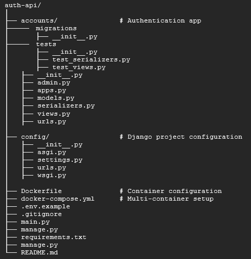

# Django Authentication API

A containerized authentication REST API built with Django Django Rest Framework, PostgreSQL. and JWT authentication.

This project demonstrates:
- Containerized development using Docker
- Token-based authentication using JWT
- Clean Git workflow with feature branches
- Code quality enforcement using Black and Flake8
- AI-assisted development with documentation of tool usage

# Project Overview

This API provides basic authentication functionality for applications such as web or mobile clients.

Supported capabilities:
- User registration
- User login
- JWT access and refresh tokens
- Secure password hashing
- PostgreSQL persistence
- Containerized runtime environment

The API is designed as a standalone authentication service that could be integrated into larger systems.

## Tech Stack

- Python 3.14
- Django
- Django REST Framework
- PostgreSQL
- JWT Authentication (SimpleJWT)
- Docker and Docker Compose
- Black
- Flake8

## Project Structure

## Setup Instructions

### Clone Repository

https://github.com/darwindc12/auth-api.git

### Run with Docker(Recommended)
#### Build Containers: docker-compose build
#### Start Services: docker-compose up
#### Run Migrations: docker-compose exec web python manage.py migrate
#### API will be available at: http://localhost:8000/

## Database Configuration
### PostgreSQL runs in Docker with:
#### Database: authdb
#### User: authuser
#### Password: authpassword
#### Host : db
#### Port: 5432

## Authentication Endpoints

#### Base URL: /api/auth
#### Register: POST /api/auth/register/
#### Login(Get Tokens): POST /api/auth/login/
#### Refresh Token: POST /api/auth/refresh/

## Code Quality
This project enforces basic code quality standards.

### Black (Code Formatter)
Black ensures consistent Python formatting.

Run formatter:
    black .

### Flake8 (Linting)
Flake8 checks for style violations and potentials issues.

Run linting: flake8

Typical checks include:
- unused imports
- line length violations
- syntax issues
- PEP8 compliance

## AI Assistance:
This project used AI tools such as ChatGPT and Github Copilot to assist wit debugging, code suggestions, and architectura
brainstorming. All design decisions, testing, and final implementation were completed by the developer.